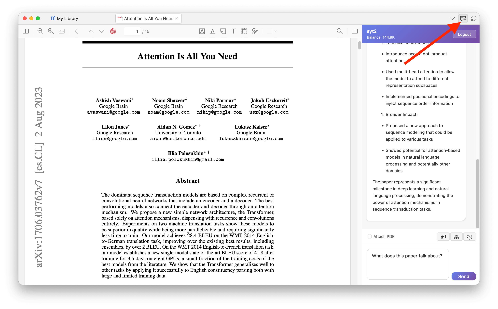
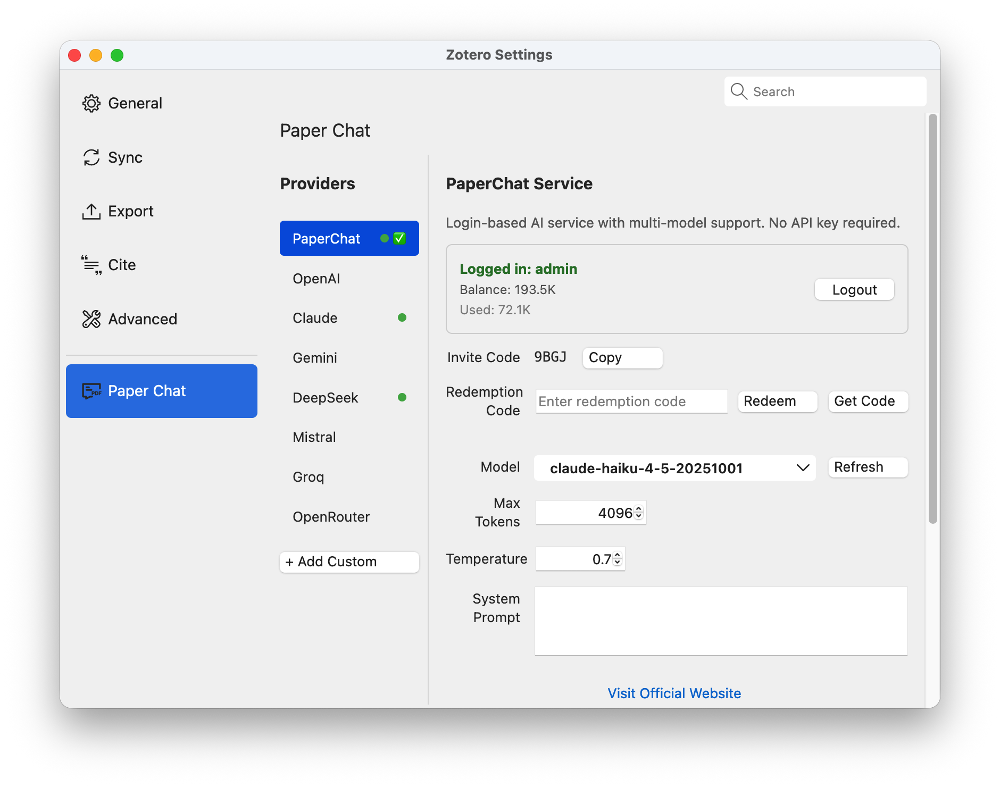

# PDF AI Talk

> **This project was entirely developed by AI.**

Chat with AI about your PDF documents directly in Zotero. Supports OpenAI, Claude, Gemini, DeepSeek, and more.

[English](README.md) | [简体中文](doc/README-zhCN.md)

## Screenshots

| Chat Panel | Settings |
|:----------:|:--------:|
|  |  |

## Features

- **Multi-Provider**: OpenAI, Claude, Gemini, DeepSeek, Mistral, Groq, OpenRouter, or custom API
- **PDF Context**: Attach PDF content for context-aware responses
- **Streaming**: Real-time response streaming
- **History**: Per-document conversation history
- **Markdown**: Full markdown with syntax highlighting
- **Themes**: Auto dark/light mode

## Installation

1. Download `.xpi` from [Releases](https://github.com/syt2/pdf-ai-talk/releases)
2. Zotero → `Tools` → `Add-ons` → ⚙️ → `Install Add-on From File...`

## Quick Start

1. Open a PDF in Zotero
2. Click the chat icon in toolbar
3. Check "Attach PDF" to include document context
4. Start chatting!

## Configuration

Go to `Settings` → `PDF AI Talk` to:
- Select AI provider and model
- Enter API key (or use built-in PDFAiTalk service)
- Adjust temperature, max tokens, system prompt

## License

[AGPL-3.0](LICENSE)

## Acknowledgments

- [Zotero Plugin Template](https://github.com/windingwind/zotero-plugin-template)
- [Claude](https://claude.ai/) - AI that developed this project
