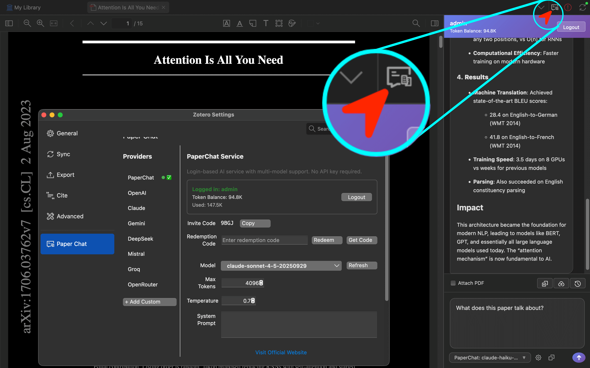
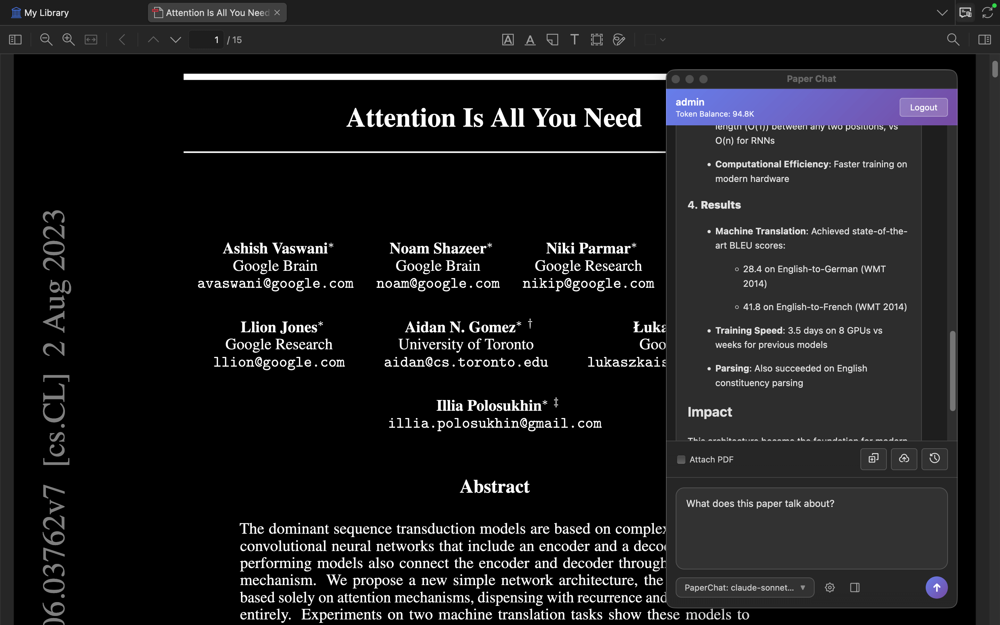

<h1> AI Paper Chat</h1>

**AI research assistant: chat with papers, translate selections, find literature, and generate notes and slides.**

Read, discuss, and organize research directly in Zotero, with a sidebar or floating chat window. Use the built-in PaperChat service or connect your own AI provider.

[English](README.md) | [简体中文](doc/README-zhCN.md)

[Download](https://github.com/syt2/paper-chat-for-zotero/releases/latest) · [Quick start](#quick-start) · [Report an issue](https://github.com/syt2/paper-chat-for-zotero/issues)

## What you can do

| Feature                        | How it helps                                                                                                                           |
| ------------------------------ | -------------------------------------------------------------------------------------------------------------------------------------- |
| **Chat with papers**           | Ask about methods, findings, equations, and figures. Reference library items, notes, or multiple papers with `@` mentions.             |
| **Translate selections**       | Select text in a PDF and translate it beside the passage. Choose the model and target language in the translation window.              |
| **Find literature**            | Search your Zotero library and external scholarly sources from the conversation.                                                       |
| **Create notes and summaries** | Turn replies or conversations into Zotero notes, or generate paper summaries with configurable templates.                              |
| **Generate presentations**     | Create a PPTX from a paper, choose a slide count and style, and resume interrupted generation from saved progress. Requires PaperChat. |
| **Discuss attachments**        | Attach selected passages, PDF screenshots, images, and supported text files. Drag local files into the chat.                           |

Conversations support streaming replies, Markdown, equations, syntax highlighting, searchable history, and navigation through long discussions. The interface supports English and Chinese, with light and dark themes.

## Screenshots

|                     Chat panel and settings                      |                     Floating chat window                      |
| :--------------------------------------------------------------: | :-----------------------------------------------------------: |
|  |  |

## Installation

Requires **Zotero 7–10**.

1. Download `ai-paper-chat.xpi` from the [latest release](https://github.com/syt2/paper-chat-for-zotero/releases/latest).
2. In Zotero, open **Tools → Plugins** (called **Add-ons** in some versions).
3. Click the gear icon, choose **Install Add-on From File…**, and select the downloaded `.xpi`.

## Quick start

### 1. Choose an AI service

Open Paper Chat in Zotero's settings, or click the settings button in the chat panel.

- **PaperChat:** sign in to use the built-in service and its available models.
- **Your own provider:** choose OpenAI, Claude, Gemini, DeepSeek, or a custom OpenAI-compatible endpoint, then enter your API key and select a model.

Image input and tool-based features depend on the selected model and provider. PPT generation currently requires the PaperChat service.

### 2. Ask about a paper

Open a PDF in Zotero, click the Paper Chat icon in the toolbar, and ask a question. The current paper is available as context; the assistant can read or search it as needed.

Try:

- “What problem does this paper address, and what is its main contribution?”
- “Explain Figure 2 and how it supports the conclusion.”
- “Find related papers and compare their methods.”

Use `@` to add library items or notes. Use **+** in the input box to upload supported files or capture a PDF figure. You can also start a general conversation from the library view.

### 3. Translate a passage

Select text in the PDF and hover over the small question-mark icon. Choose **Translate** to stream a translation beside the selection, or the send icon to attach the passage to chat.

The translation window lets you choose a model and language. **Auto** language follows Zotero's interface language; drag the window by its header to reposition it.

### 4. Save notes or make slides

- **Conversation note:** choose **+ → Notes** to organize the current discussion into a Zotero note.
- **Paper summary:** right-click an item or PDF attachment and choose **Generate AI Quick Summary** or **Generate Deep AI Summary**.
- **Presentation:** open or select one paper with a PDF, choose **+ → PPT**, confirm the source paper, slide count, and style, then start generation. Paused presentations can resume from saved progress, including after restarting Zotero.

## Settings

Use the plugin settings to manage providers, models, PaperChat account and quota, and summary templates. Translation model and language choices are available directly in the translation window.

## Feedback

Report bugs or suggest improvements in [GitHub Issues](https://github.com/syt2/paper-chat-for-zotero/issues). For bugs, include your Zotero version, plugin version, operating system, and steps to reproduce the problem.

## License and acknowledgments

Licensed under [AGPL-3.0-or-later](LICENSE).

Built with AI assistance and the [Zotero Plugin Template](https://github.com/windingwind/zotero-plugin-template) and [Zotero Plugin Toolkit](https://github.com/windingwind/zotero-plugin-toolkit).
