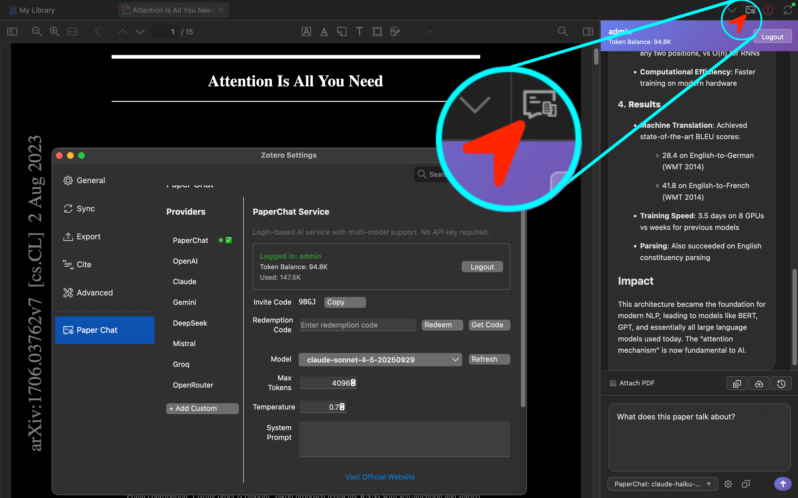

<h1> Paper Chat</h1>

> **本项目完全由 AI 开发完成。**

在 Zotero 中直接与 AI 讨论 PDF 文档。支持 OpenAI、Claude、Gemini、DeepSeek 等多种服务商。

[English](../README.md) | [简体中文](README-zhCN.md)

## 截图

|              边栏与设置窗口               |                 浮动窗口                  |
| :---------------------------------------: | :---------------------------------------: |
|  |  |

## 功能特性

- **多服务商**: OpenAI、Claude、Gemini、DeepSeek、Mistral、Groq、OpenRouter 或自定义 API
- **PDF 上下文**: 附加 PDF 内容获得上下文感知回复
- **AI 摘要**: 自动生成论文摘要，支持自定义模板
- **@ 提及**: 在对话中引用条目、附件和笔记
- **流式输出**: 实时响应流
- **历史记录**: 每个文档支持多会话独立对话历史
- **Markdown**: 完整 Markdown 支持，含语法高亮
- **主题适配**: 自动深色/浅色模式
- **多语言**: 支持中英文界面

## 安装

1. 从 [Releases](https://github.com/syt2/paper-chat-for-zotero/releases) 下载 `.xpi` 文件
2. Zotero → `工具` → `附加组件` → ⚙️ → `从文件安装附加组件...`

## 快速开始

### 与 PDF 对话
1. 在 Zotero 中打开 PDF
2. 点击工具栏中的聊天图标
3. 勾选"附加 PDF"以包含文档上下文
4. 开始聊天！

### AI 摘要
1. 右键点击条目或 PDF 附件
2. 选择"生成 AI 摘要"
3. AI 生成的摘要将自动创建为笔记

## 配置

进入 `设置` → `Paper Chat`：

- 选择 AI 服务商和模型
- 输入 API Key（或使用内置 PaperChat 服务）
- 调整温度、最大 Token 数、系统提示词
- 配置 AI 摘要模板和选项

## 许可证

[AGPL-3.0](../LICENSE)

## 致谢

- [Zotero Plugin Template](https://github.com/windingwind/zotero-plugin-template)
- [Claude](https://claude.ai/) - 开发本项目的 AI
